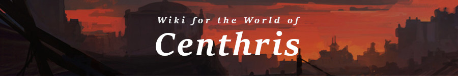
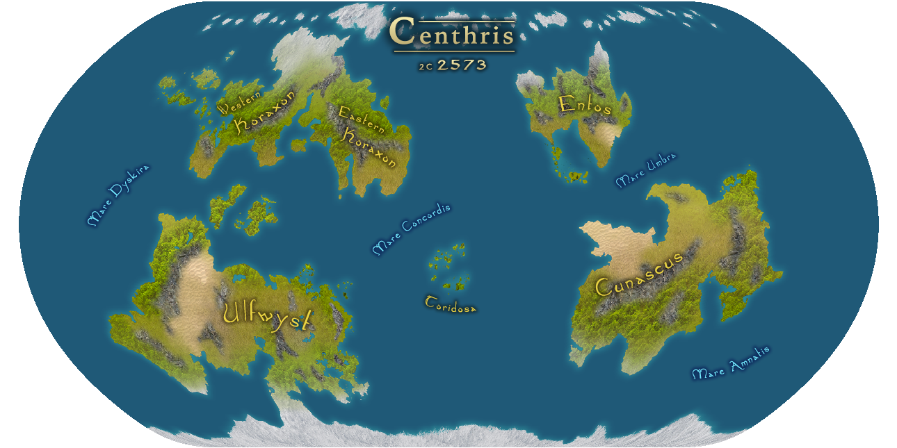

The world of Centhris, in many ways, resembles our own in the early days of the Italian Renaissance, Ming dynasty, and Age of Exploration. Innovations in political thought, arcane study, and scientific theory are beginning to shake the foundations of old structures. After a millennia of recovery from the world shattering calamity of the Ruination, a new age of enlightenment has begun. As the various peoples of the world embrace innovations in science, magic and technology, great nations, and the powerful political interests at their center, seek to maintain control, lest they be swept away in the tide.

Far from the clamour and tumult of the world's great cities, the people of small towns and villages make use of their day to day lives farming, hunting, foraging and building. The world beyond the civilized borders is as dangerous as it has ever been, with dangerous beasts, restless spirits, and savage warlords carving out their claim in the wild lands beyond the fortified walls of castle and village.

## What is this Wiki?

The Centhris wiki is a dynamically-linked, scalable wiki project started in 2019 for use in a weekly Dungeons & Dragons campaign created by [Michael Curtis](https://github.com/Typhos). The goal of the project was to provide the players in the campaign with a centralized, easy to access source for any people, places, monsters, items, or any other possible game content that might be important during game sessions.

The crux of the project is the dynamic linking methodology, which allows the writer to create articles for elements of the game without requiring retroactive updates to every article which might link to future content. This allows a single creative writer to build out a complete fantasy setting as a single contributor, instead of the large numbers of editors required for larger, crowd sourced wikis.

## Project Features

- [Navigation](#nav)
- [Search](#search)
- [Map](#map)
- [Curated Linking](#curated)
- [Content Categories](#categories)
- [Content Articles](#articles)
- [Timeline](#timeline)
- [DM Mode](#dm)

## Navigation

The navigation allows the user to switch between various top-level pages on the wiki. The navigation component is used primari sub-component of the header.

The _desktop navigation_ provides the user with a modal overlay that appears on the left side of the browser and closes when a selection is made. The _mobile navigation_ puts an overlay over the entire site due to space requirements, and closes when the user is done making a selection.

## Search

The search component is used as a sub-component of the header. After the user inputs 3 or more characters, the custom search algorithm finds the top matching entries for the search input. These are displayed in a small modal overlay which appears under the search input.

## Map

The map feature is located on its own page and uses the [MapBox API](https://www.mapbox.com/), along with custom vector designs and geolocation data to present the continent of [Ulfwyst](http://localhost:3000/location/Ulfwyst) in a navigable, Google Maps style interface.

The map includes geographic and terrains features, castle or fortress locations, town, city, and capital locations. Elements placed on the map can be clicked on to bring up their corrisponding information box, and a link to their wiki article, if one exists and is visible to the players.

## Content Categories

Category pages are the jumping off point for much of the wiki's content. They provide the user with sorted lists of available articles. The category pages present the user with a given article's image and article name. If no image is provided, a placeholder is present in its place.

Some category pages are broken down by sub-category (such as the Places category). These categories are organized by local grouping type, which can be dynamically added to by simply creating a new article with a new type. The wiki will then add the article to the appropriate sub-category as required.

## Content Articles

Articles are the crux of any wiki, and that is certainly the case for the Centhris wiki. Articles are where the all the important data about a given topic is presented in a easily consumable fashion.

Each article contains a main section, which can be topped by a **quote section**, possibly a quote from a character, or a fun blurb about the location in question.

The **main descriptive paragraphs** then come directly under the quote, generally providing an overview or brief description about the person, place or thing the article will expand upon.

The **articles section** is a place for sub-articles detailing specific elements that can be expanded upon for a given topic. This might include historical, cultural or personal information depending on the article in question.

The final main section of an article are the **DM articles**. These are articles only available to someone accessing the wiki in [DM mode](#dm). This section works just as the articles section above it, however it is intended to be a place for DMs to either write content intended to be shared later, or information that is DM only knowledge.

The right side of every article contains an **information card**. There are various sub-components which are article type specific (person, place, item, monster, etc). The info card is intended to provide the user with quick, cursory information related to the topic for easy reference.

## Curated Linking

The curated content page is a custom category page with data specifically chosen by the dungeon master. This content is intended to allow the DM to keep a category page of linked content that is directly related to the current in-game events happening during a given game session or story arc.

## Timeline

The timeline is a one-off page which builds a data-driven timeline of historical events in the history of the game world. The timeline has a variety of event types, such as as ages, epochs, conflicts and player-focused events. Items that are added to the timeline data are automatically sorted by age (the Convergences, if you care for in-world lore) and then by date.

## DM Mode

DM mode is a special feature design to allow a content creator to access hidden articles that the players should not have access to, either because it is not known to their characters or because it is additional information provided in an article for DM reference or assistance.

DM mode can be accessed by the DM by entering in a special access code via their keyboard which will then toggle the state of DM mode. The DM can tell they are in DM mode due to an on-screen banner indicating that DM mode is active.

DM mode also allows the writer to see the state of their articles, both hidden and commonly visible. On the appropriate parent category page for the article, the DM will be presented with icons on the article name. An eye icon 👁️ indicates that the article is hidden from the standard user. A writing icon ✍🏼 indicates that the article is a stub and needs to be expanded in order to be considered "complete".
